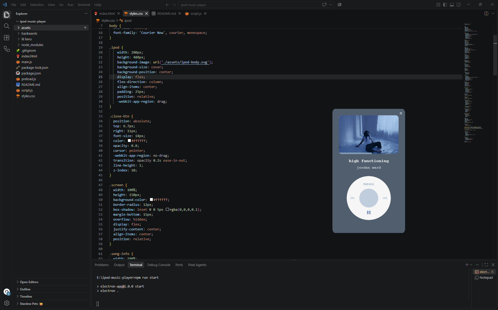
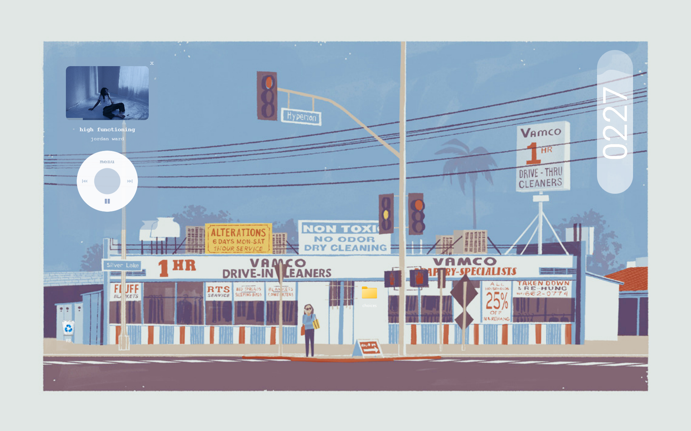

## iPod Music Player

A simple desktop music player app with an iPod classic look, built with **Electron**. 

Play your local music files in a cute, frameless widget that sits on your desktop. 




---

## What's Included 

- Play local audio files (MP3, WAV, OGG, M4A, FLAC, WEBM, OPUS, AAC)
- Shows album art (looks for 'cover.jpg', 'folder.png', or an image named after the song)
- Click wheel controls (menu, prev, next, play/pause, center)
- Progress bar with click-and-drag seeking 
- Keyboard shortcuts for quick control 
- Frameless, non-resizable, transparent window that looks like a real iPod widget 
---

## ✅ Before You Start

You need **Node.js** installed on your computer. To check:

```bash
node -v
npm -v
```
If both print a version number, you're set. If not, download it from nodejs.org. 
---

## Project Structure

```
ipod-music-player/
├── assets/            
├── music/             
├── main.js            
├── preload.js         
├── index.html        
├── styles.css         
├── script.js          
├── package.json       
└── README.md          
```
---

## Keyboard Shortcuts

| Key | Action |
|-----|--------|
| `Space` | Play / Pause |
| `→` | Skip forward 5 seconds |
| `←` | Skip back 5 seconds |
| `↑` | Volume up |
| `↓` | Volume down |
| `N` | Next track |
| `P` | Previous track |
---

## Setup

### 1. Clone or download this project and open a terminal inside the folder.
```bash 
git clone https://github.com/cashmurb/ipod-music-player.git
cd ipod-music-player
``` 

### 2. Install dependencies 

```bash 
npm install 
```

### 3. Run the App 
```bash 
npm run start 
```
A small iPod window should appear on your screen. 
---

## How to Use 

1. Click the **"menu"** text on the click wheel (or the **center button**).
2. A folder picker opens. Select a folder that contains your music.
3. The first song starts playing automatically.
4. Use the click wheel buttons:
   - **⏮ Prev** — go to the previous track
   - **⏭ Next** — skip to the next track
   - **▶ / ❚❚ Play/Pause** — toggle playback
   - **menu / center** — open the folder picker again
5. Click or drag the thin bar at the bottom of the screen to seek.

> **Tip:** Name your files like `Artist - Song Title.mp3` and the player will split them into artist and song name automatically.
---

## Credits 
- Built on top of the electron-app-template by @nasha-wanich. 
- Design inspired by the classic iPod. 
---

## License
This project is for funsies. Enjoy!
